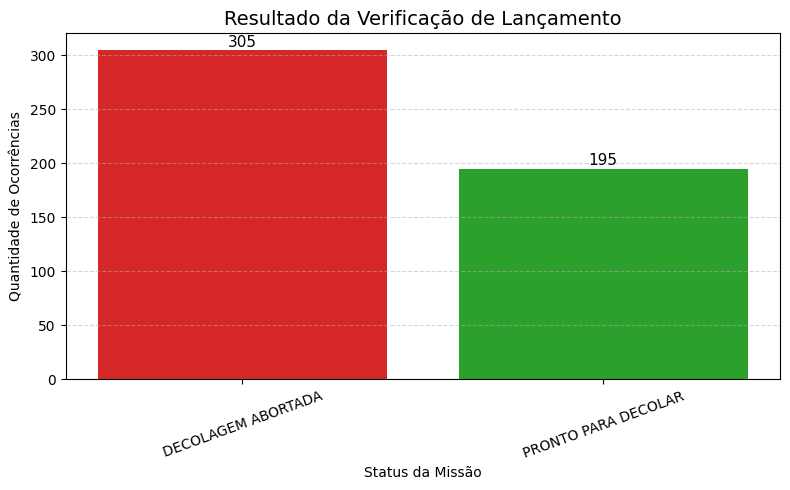
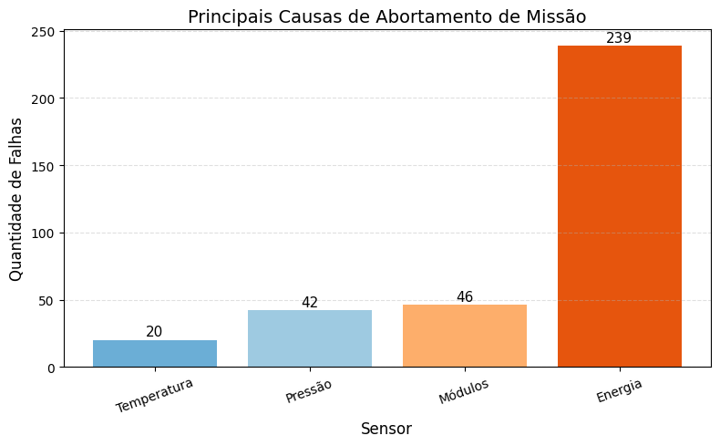

# 🚀 Projeto Aurora-Siger

## 📌 Descrição
Este projeto tem como objetivo simular e analisar condições de lançamento de foguetes a partir de dados de telemetria.

Utilizando Python, foram aplicadas regras baseadas em limites operacionais para classificar automaticamente o status da missão.

---

## ⚙️ Tecnologias Utilizadas
- Python
- Pandas
- Matplotlib
- Jupyter Notebook

---

## 🧠 Lógica do Algoritmo

O sistema avalia os seguintes critérios:

- Integridade estrutural
- Pressão do tanque
- Nível de energia
- Temperatura interna
- Funcionamento dos módulos:
  - Navegação
  - Propulsão
  - Comunicação

### Possíveis resultados:
- ❌ DECOLAGEM ABORTADA  
- ⚠️ PRONTO PARA DECOLAR COM ALERTA  
- ✅ PRONTO PARA DECOLAR  

---

## 📊 Resultados

- ❌ Decolagens abortadas: **305**
- ✅ Pronto para decolar: **195**

---

## 📈 Distribuição dos Resultados

---

## 🚨 Principais Causas de Abortamento

- 🔋 Energia: 239 ocorrências  
- ⚙️ Módulos: 46 ocorrências  
- 🌡️ Pressão: 42 ocorrências  
- 🌡️ Temperatura: 20 ocorrências  

---

## 🔍 Análise

A principal causa de abortamento está relacionada ao **nível de energia insuficiente**, indicando que este é o fator crítico no sistema.

Falhas em módulos também apresentam impacto relevante, enquanto temperatura e pressão têm menor influência relativa.

## Reflexão Crítica
O uso de sistemas automatizados para análise de dados e tomada de decisão em contextos críticos, como missões espaciais, levanta importantes questões relacionadas à ética, responsabilidade e impacto social da tecnologia.
Do ponto de vista ético, é fundamental garantir que os sistemas de decisão automatizados sejam transparentes, confiáveis e devidamente supervisionados por operadores humanos. Embora algoritmos possam auxiliar na análise de grandes volumes de dados, a responsabilidade final pelas decisões em sistemas críticos deve permanecer sob controle humano.
No contexto da exploração espacial, os avanços tecnológicos possibilitam importantes benefícios científicos e sociais, como o desenvolvimento de novas tecnologias, melhoria dos sistemas de comunicação e maior compreensão do universo. No entanto, também é necessário considerar os desafios relacionados à sustentabilidade tecnológica, incluindo o aumento do número de detritos espaciais e o impacto ambiental associado aos lançamentos.
Dessa forma, o desenvolvimento de sistemas inteligentes para monitoramento e análise de dados deve sempre considerar não apenas a eficiência operacional, mas também os princípios de segurança, responsabilidade e sustentabilidade no uso da tecnologia.
